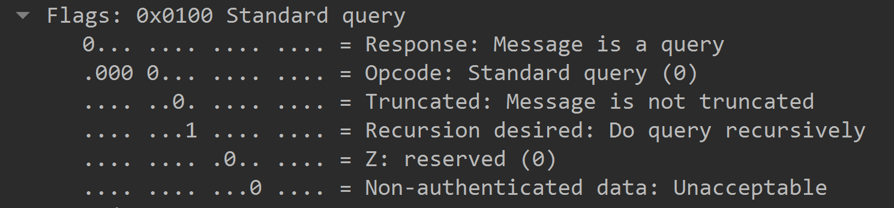

# Einführung in TCP/IP

---

---

## Was es braucht, um die Website der NZZ aufzurufen

- eine Adresse
- www.nzz.ch

Was geschieht, wenn die Adresse www.nzz.ch aufgerufen wird?

---

### URL zu IP-Adresse

Die URL wird durch eine Anfrage auf einem Domain Name System Server in
eine IP-Adresse übersetzt. Dieser Vorgang lässt sich mittels Wireshark
beobachten.

Die IP Adresse 192.168.160.106 ruft die IP Adresse 9.9.9.9 auf, um die
IP Adresse von www.nzz.ch abzufragen.  
192.168.160.106 ist der Rechner, der Versucht www.nzz.ch aufzurufen.
9.9.9.9 ist der DNS Server.

---

#### IP Adresse

Es gibt zwei Arten von IP Adressen:

- IPv4  
  Diese Adressen bestehen aus 32 Bits und werden in der Form
  255.255.255.255 dargestellt
- IPv6  
  Diese (neueren) Adressen bestehen aus 128 Bits und werden hexadezimal
  dargestelt. Eine IPv6 Adresse hat für die Darstellung das Format
  2001:0db8:85a3:0000:0000:8a2e:0370:7344
  
Obwohl der Adressraum von IPv4 Adressen knapp wird, ist es aktuell immer
noch die vorhersschende Form der Adressierung im Internet.

---

### URL zu IP-Adresse

---

## Das Domain Name System

Grundsätzlich werden Computer über eine Adresse aus Zahlen angesprochen.
Die entsprechende Adresse der NZZ lautet:  
194.40.217.80  
Aufgrund von Servereinstellungen ist die NZZ so allerdings nicht
erreichbar. Versuchen Sie jedoch die IP-Adresse 142.250.203.99 zu erreichen.

---

### Domain Name System - Server

Was geschieht, wenn eine URL im Browser eingegeben wird?

Es wird eine Anfrage an einen DNS-Server gestartet.
 

---

## Das OSI- bzw. IP-Layer Modell

---