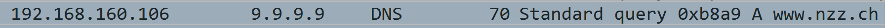

# Einführung in TCP/IP

---

<!--
Die SuS erhalten den ganzen Artikel aus der NZZ vom 24. Oktober 22. Basierend auf Fragen zum Artikel kann dann in das Thema TCP/IP eingeführt werden.
-->

---

## Was es braucht, um die Website der NZZ aufzurufen

- eine Adresse
- www.nzz.ch

Was geschieht, wenn die Adresse www.nzz.ch aufgerufen wird?

---

### URL zu IP-Adresse

Die URL wird durch eine Anfrage auf einem Domain Name System Server in
eine IP-Adresse übersetzt. Dieser Vorgang lässt sich mittels Wireshark
beobachten.

Die IP-Adresse 192.168.160.106 ruft die IP-Adresse 9.9.9.9 auf, um die
IP-Adresse von www.nzz.ch abzufragen.  
192.168.160.106 ist der Rechner, der Versucht www.nzz.ch aufzurufen.
9.9.9.9 ist der DNS Server.

<!--
Die Beobachtung mittels Wireshark ist als Demonstration möglich. Falls die SuS Wireshark installiert haben, können sie die entsprechenden Beobachtungen selber durchführen.

Die Besprechung des Resultates in der Packetlistenanzeige von Wireshark führt dann zur Diskussion der IPv4-Adressen und der DNS Anfrage auf den kommenden Folien.

Trotz allfälliger Bedenken gegenüber dem Einsatz von Wireshark durch die SuS bin ich der Auffassung, dass die SuS unbedingt mit den richtigen Werkzeugen arbeiten sollen. Die Beschränkung auf Lernprogramme untergräbt die Glaubwürdigkeit der LP.
-->

---

#### IP-Adresse

Es gibt zwei Arten von IP-Adressen:

- IPv4  
  Diese Adressen bestehen aus 32 Bits und werden in der Form
  255.255.255.255 dargestellt
- IPv6  
  Diese (neueren) Adressen bestehen aus 128 Bits und werden hexadezimal
  dargestellt. Eine IPv6 Adresse hat für die Darstellung das Format
  2001:0db8:85a3:0000:0000:8a2e:0370:7344
  
Obwohl der Adressraum von IPv4 Adressen knapp wird, ist es aktuell immer
noch die vorherrschende Form der Adressierung im Internet.

<!--
An dieser Stelle ist die Präsentation zu unterbrechen um mit den SuS über die Anzahl verfügbarer Adressen und den Bedarf an verfügbaren Adressen zu sprechen.
-->

---

##### IPv4-Adresse

- IPv4-Adressen werden in verschiedene Gruppen unterteilt.
- Für den vorliegenden Zweck reicht die Unterteilung in öffentliche und
  private Adressen. Private Adressen sind die folgenden drei Blöcke:
  - 10.0.0.0 – 10.255.255.255
  - 172.16.0.0 – 172.31.255.255
  - 192.168.0.0 – 192.168.255.255
- Private Adressen sind aus dem Internet nicht direkt erreichbar. Sie
  dienen der Adressierung von Computern in einem lokalen Netzwerk.

---

##### Network Address Translation (NAT)

Damit die Kommunikation zwischen Computern mit einer öffentlichen und
solchen mit einer privaten IPv4-Adresse funktioniert, wird im Router die
private Adresse des lokalen Computers in die Adresse des Routers
übersetzt. 

---

##### Network Address Translation (NAT)

Quelle: Fall, Kevin R., und W. Richard Stevens. TCP/IP illustrated, volume 1:The Protocols. 2nd ed. Addison-Wesley professional computing series. Upper Saddle River, NJ: Addison-Wesley, 2012, page 304.

---

### URL zu IP-Adresse

Grundsätzlich ist eine DNS Anfrage 512 Bytes lang.  
Der Erste Teil ist eine 16 Bit lange Transaktions-ID. Diese wird gefolgt
von einer 12 Byte langen Sequenz aus verschiedenen Flags bevor die
eigentliche Anfrage kommt.  
Auf der folgenden Folie findet sich eine schematische Darstellung einer
solchen DNS Anfrage[1]

[1]: Quelle: Fall, Kevin R., und W. Richard Stevens. TCP/IP illustrated,
volume 1:The Protocols. 2nd ed. Addison-Wesley professional computing
series. Upper Saddle River, NJ: Addison-Wesley, 2012, page 521.

---

### URL zu IP-Adresse

  

---

## Das Domain Name System

Grundsätzlich werden Computer über eine Adresse aus Zahlen angesprochen.
Die entsprechende Adresse der NZZ lautet:  
194.40.217.80  
Aufgrund von Servereinstellungen ist die NZZ so allerdings nicht
erreichbar. Versuchen Sie jedoch die IP-Adresse 142.250.203.99 zu erreichen.

---

### Domain Name System - Server

Was geschieht, wenn eine URL im Browser eingegeben wird?

Es wird eine Anfrage an einen DNS-Server gestartet.
 

---

## Das OSI- bzw. IP-Layer Modell

---