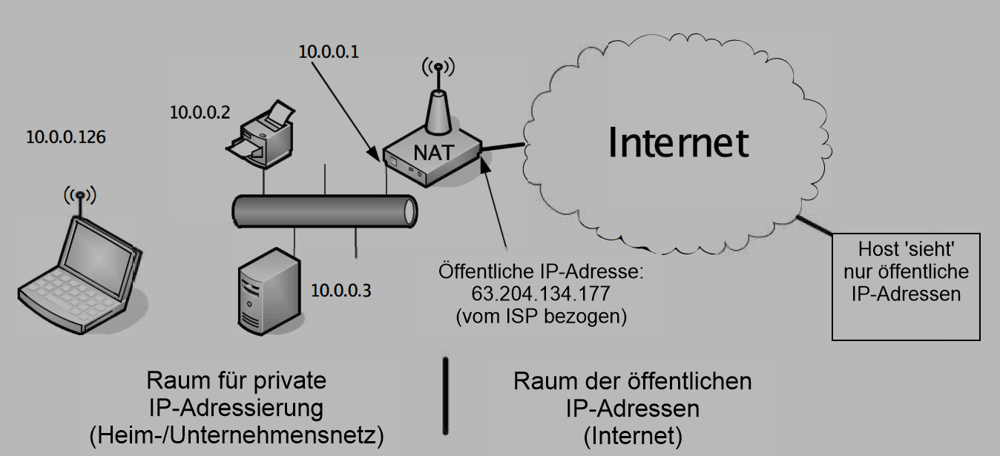
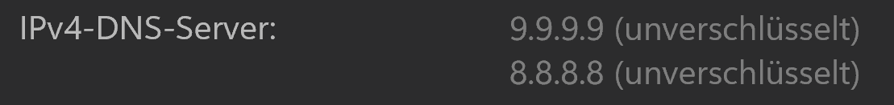

<style>
    section { justify-content: start; }
</style>

<style scoped>
  h1 {color: white;
      background-color: rgba(0, 0, 0, 0.35);
      border-radius: 4px;
      }
section {
  background-image: url('../data/images/telefonvermittlung.jpg'); /* Pfad zum Hintergrundbild */
  background-size: cover; /* Stellt sicher, dass das Bild die ganze Folie bedeckt */
  background-position: center; /* Zentriert das Bild */
}
.footer-text {
  position: absolute;
  bottom: 10px; /* Positionierung vom unteren Rand */
  right: 10px; /* Positionierung vom rechten Rand */
  background-color: rgba(0, 0, 0, 0.6); /* Semitransparenter schwarzer Hintergrund */
  color: white; /* Weiße Textfarbe */
  padding: 5px 10px; /* Innenabstand */
  border-radius: 4px; /* Abgerundete Ecken */
  font-size: 12pt; /* Kleinere Schriftgröße */
}

</style>

# Einführung in TCP/IP

<div class="footer-text">
  Quelle: Museum für Kommunikation (https://bit.ly/3Qqu6Nk), besucht am 29. April 2024.
</div>

---

<!-- paginate: true -->


<!--
Die SuS erhalten den ganzen Artikel aus der NZZ vom 24. Oktober 22. Basierend auf Fragen zum Artikel kann dann in das Thema TCP/IP eingeführt werden.
-->

---

<style scope>
h2 {
  position: absolute; /* Absolutes Positionieren innerhalb der section */
  top: 0;             /* Setzt es an den oberen Rand der Folie */
  width: 100%;
  margin-top: 20px;   /* Optional: Abstand vom oberen Rand */

}

.content {

  flex-grow: 1;
  display: flex;
  flex-direction: column;
  justify-content: center;
}
</style>

## Aufruf einer Website am Beispiel der NZZ

<div class="content">
Was geschieht, wenn die Adresse www.nzz.ch aufgerufen wird?

* Diese Frage wird im folgenden Schritt für Schritt beantwortet.
</div>


---

## Experiment 1: ping nzz.ch

```txt  
    Ping wird ausgeführt für nzz.ch [194.40.217.80] mit 32 Bytes Daten:
    Antwort von 194.40.217.80: Bytes=32 Zeit=10ms TTL=55
    Antwort von 194.40.217.80: Bytes=32 Zeit=10ms TTL=55
    Antwort von 194.40.217.80: Bytes=32 Zeit=8ms TTL=55
    Antwort von 194.40.217.80: Bytes=32 Zeit=14ms TTL=55

    Ping-Statistik für 194.40.217.80:
        Pakete: Gesendet = 4, Empfangen = 4, Verloren = 0
        (0% Verlust),
    Ca. Zeitangaben in Millisek.:
        Minimum = 8ms, Maximum = 14ms, Mittelwert = 10ms

```
* Was ist die IP-Adresse?
* Woher kommt die IP-Adresse für nzz.ch?

<!--
Besprechen der Ausgabe des Befehls ping nzz.ch. Insbesondere ist darauf hinzuweisen, dass nzz.ch in 194.40.217.80 übersetzt wird.
-->

---

<style scope>
h2 {
  position: absolute; /* Absolutes Positionieren innerhalb der section */
  top: 0;             /* Setzt es an den oberen Rand der Folie */
  width: 100%;
  margin-top: 20px;   /* Optional: Abstand vom oberen Rand */

}

.content {

  flex-grow: 1;
  display: flex;
  flex-direction: column;
  justify-content: center;
}
</style>

#### IP-Adresse

<div class="content">
Die IP-Adresse ist eine eindeutige Nummer, unter welcher ein Computer im
Internet erreichbar ist.
</div>

---

#### IP-Adresse

Es gibt zwei Arten von IP-Adressen:

* IPv4  
  Diese Adressen bestehen aus 32 Bits und werden in der Form
  255.255.255.255 dargestellt
* IPv6  
  Diese (neueren) Adressen bestehen aus 128 Bits und werden hexadezimal
  dargestellt. Eine IPv6 Adresse hat für die Darstellung das Format
  2001:0db8:85a3:0000:0000:8a2e:0370:7344
  
* Obwohl die Adressen im Adressraum von IPv4 Adressen knapp werden, ist
  es aktuell immer noch die vorherrschende Form der Adressierung im Internet.

<!--
An dieser Stelle ist die Präsentation zu unterbrechen um mit den SuS über die Anzahl verfügbarer Adressen und den Bedarf an verfügbaren Adressen zu sprechen.
-->

---

##### IPv4-Adresse

* IPv4-Adressen werden in verschiedene Gruppen unterteilt.
* Für den vorliegenden Zweck reicht die Unterteilung in öffentliche und
  private Adressen. Private Adressen sind die folgenden drei Blöcke:
  - 10.0.0.0 – 10.255.255.255
  - 172.16.0.0 – 172.31.255.255
  - 192.168.0.0 – 192.168.255.255
* Private Adressen sind aus dem Internet nicht direkt erreichbar. Sie
  dienen der Adressierung von Computern in einem lokalen Netzwerk.

---

##### Exkurs Network Address Translation (NAT)

<style scope>
h2 {
  position: absolute; /* Absolutes Positionieren innerhalb der section */
  top: 0;             /* Setzt es an den oberen Rand der Folie */
  width: 100%;
  margin-top: 20px;   /* Optional: Abstand vom oberen Rand */

}

.content {

  flex-grow: 1;
  display: flex;
  flex-direction: column;
  justify-content: center;
}
</style>

<div class="content">
Damit die Kommunikation zwischen Computern mit einer öffentlichen und solchen mit einer privaten IPv4-Adresse funktioniert, wird im Router die private Adresse des lokalen Computers in die Adresse des Routers übersetzt. 

Diese Übersetzung zwischen internen und externen IPv4 Adressen hat das Problem der knapper werdenden IPv4 Adressen entschärft.
</div>

<!--
NAT soll nicht vertieft werden. Die kursorische Behandlung soll lediglich sicherstellen, dass der Übergang von einem Intranet ins Internet nachvollzogen werden kann.
-->

---

##### Exkurs Network Address Translation (NAT)
<style scoped>
p {font-size: 12px}
</style>



Quelle: Fall, Kevin R., und W. Richard Stevens. TCP/IP illustrated, volume 1:The Protocols. 2nd ed. Addison-Wesley professional computing series. Upper Saddle River, NJ: Addison-Wesley, 2012, page 304.

---

### Domain Name System (DNS)

Um die Webite der NZZ erreichen zu können, muss die zur URL www.nzz.ch gehörige IP-Adresse gefunden werden.  

Dieser Vorgang wird als Namensauflösung (*name resolution*) bezeichnet.  

Das hier vorgestellte Verfahren basiert auf einer dezentralen Datenbank mit dem Namen *Domain Name System (DNS)*.

---

### Domain Name System (DNS)

Damit einer der dezentralen DNS-Server erreicht werden kann, muss dessen Adresse auf dem lokalen Computer in der Systemeinstellung abgelegt sein.

Welcher das ist, findet sich in den Netzwerkeinstellungen des lokalen Computers (Netzwerk und Internet > Netzwerkzugang > Eigenschaften > DNS-Server).  



Beide hier eingetragenen DNS-Server wurden manuell festgelegt. 

<!--
Die SuS erhalten die Gelegenheit, die eigenen Einstellungen zu überprüfen.
-->

---

#### Ein paar Gedanken zu den lokalen DNS-Einstellungen


* Welche Reaktionszeit hat der DNS-Server?
* Verwendet der DNS-Server ein aktuelles Sichherheitsdispositiv?
* Schützt der DNS-Server meine Privatsphäre?


<!--
Die SuS machen ein Ping gegen ihren DNS-Server sowie gegen 1.1.1.1 (Cloudflare), 8.8.8.8 (Google) oder 9.9.9.9 (Quad9).

Diskussion möglicher Gefahren im Zusammenhang mit DNS-Abfragen.

Diskussion der Möglichkeiten von Eingriffen in die Privatsphäre bei DNS-Abfragen.
-->


---

## Beobachten des Netzwerkverkehrs mit Wireshark


Um im Detail beobachten zu können, wie die Verbindung mit einer Website aufgebaut wird, wird in dieser Unterrichtseinheit der Netzwerkverkehr mit [Wireshark](https://www.wireshark.org/) aufgezeichnet und analysiert.  

Die [Installationsanleitung](https://www.wireshark.org/download.html) findet sich auf der Website von Wireshark.

---


### Experiment 2: URL zu IP-Adresse

Die URL wird durch eine Anfrage auf einem Domain Name System Server in eine IP-Adresse übersetzt. Dieser Vorgang lässt sich mittels Wireshark beobachten.

```txt
No. Time      Src            Dst      Prot length  Info 
1   0.000000  192.168.1.107  9.9.9.9  DNS  66      Standard query 0x007a A nzz.ch
```
* Von der IP-Adresse 192.168.1.107 wird die IP-Adresse 9.9.9.9 aufgerufen, um die IP-Adresse von www.nzz.ch abzufragen.  
* 192.168.1.101 ist der Rechner, der Versucht www.nzz.ch aufzurufen. 9.9.9.9 ist der DNS Server.

<!--
Die Beobachtung mittels Wireshark ist als Demonstration möglich. Falls die SuS Wireshark installiert haben, können sie die entsprechenden Beobachtungen selber durchführen.

Die Besprechung des Resultates in der Packetlistenanzeige von Wireshark führt dann zur Diskussion der IPv4-Adressen und der DNS Anfrage auf den kommenden Folien.

Trotz allfälliger Bedenken gegenüber dem Einsatz von Wireshark durch die SuS bin ich der Auffassung, dass die SuS unbedingt mit den richtigen Werkzeugen arbeiten sollen. Die Beschränkung auf Lernprogramme untergräbt die Glaubwürdigkeit der LP.
-->


---

### DNS-Anfrage

Wie sieht das DNS-Anfrage Packet aus?


Grundsätzlich ist eine DNS Anfrage 512 Bytes lang.  
Der Erste Teil ist eine 16 Bit lange Transaktions-ID. Diese wird gefolgt von einer 12 Byte langen Sequenz aus verschiedenen Flags bevor die eigentliche Anfrage kommt.  

Auf der folgenden Folie findet sich eine schematische Darstellung einer solchen DNS Anfrage.

---

### DNS-Anfrage (schematische Darstellung)

<style scoped>
p {font-size: 12px}
</style>

  

Quelle: Fall, Kevin R., und W. Richard Stevens. TCP/IP illustrated, volume 1:The Protocols. 2nd ed. Addison-Wesley professional computing series. Upper Saddle River, NJ: Addison-Wesley, 2012, page 521.

---

## DNS-Anfrage (Wireshark Packet Analyse)

```txt
Frame 10: 70 bytes on wire (560 bits), 70 bytes captured (560 bits) ...
Ethernet II, ...
Internet Protocol Version 4, Src: 192.168.124.106, Dst: 9.9.9.9
User Datagram Protocol, Src Port: 51349, Dst Port: 53
Domain Name System (query)

```

0. Zusammenfassung des Paketes (abgeschnitten)
1. Network Access Layer (abgeschnitten)
2. Internet Layer
3. Transport Layer
4. Application Layer (um den geht es)

<!--
An dieser Stelle kann das Layermodell repetiert werden.

Auf dem Internet Layer sieht man, dass die Quelle der Anfrage eine private IPv4 Adresse (192.168.124.106) ist. Das Ziel der Anfrage ist der voreingestellte DNS-Server.

Auf dem Transportlayer ist zu sehen, dass als Ausgangsport ein willkürlich gewählter Port ausserhalb des Ranges der well known ports (port > 49'151) liegt. Der Zielport für die DNS-Abfrage ist 53, der von der IANA diesem Zweck vorbehalten ist.

Auf dem Application Layer schlussendlich ist zu sehen, dass es sich um eine DNS-Anfrage handelt. Was ja auch dem Ziel der Übung entspricht.
-->

---

<style scoped>
p {font-size: 12px}
</style>

### OSI- bzw. TCP/IP-Layer Modell


Quelle: https://www.geeksforgeeks.org/tcp-ip-model/; besucht am 25. April 2024

---

## DNS-Anfrage (Wireshark Packet Analyse)

```txt
Domain Name System (query)
    Transaction ID: 0xcf66
    Flags: 0x0100 Standard query
        0... .... .... .... = Response: Message is a query
        .000 0... .... .... = Opcode: Standard query (0)
        .... ..0. .... .... = Truncated: Message is not truncated
        .... ...1 .... .... = Recursion desired: Do query recursively
        .... .... .0.. .... = Z: reserved (0)
        .... .... ...0 .... = Non-authenticated data: Unacceptable
    Questions: 1
    Answer RRs: 0
    Authority RRs: 0
    Additional RRs: 0
    Queries
        www.nzz.ch: type A, class IN
```

<!--
Der Inhalt der Anfrage kann nun mit dem Schema abgeglichen werden:

Hat die Transaction ID 0xcf66 tatsächlich eine Länge von 16 Bit? (Ja, sie entspricht 1100111101100110.)

Was ist in den Flags codiert?

Was ist der Inhalt der Anfrage?
-->

---

### DNS-Anfrage (Analyse der Antwort)

```txt
Frame 11: 86 bytes on wire (688 bits), 86 bytes captured (688 bits) on interface ...
Ethernet II, Src: ...
Internet Protocol Version 4, Src: 9.9.9.9, Dst: 192.168.124.106
User Datagram Protocol, Src Port: 53, Dst Port: 51349
Domain Name System (response)

```

<!--
Zusammenfassung der Antwort. Hier erfolgt der Hinweis auf die vertauschten IP-Adressen und Portnummern
-->

---

### DNS-Anfrage (Analyse der Antwort)

```txt
Domain Name System (response)
    Transaction ID: 0xcf66
    Flags: 0x8180 Standard query response, No error
        1... .... .... .... = Response: Message is a response
        .000 0... .... .... = Opcode: Standard query (0)
        .... .0.. .... .... = Authoritative: Server is not an authority for domain
        .... ..0. .... .... = Truncated: Message is not truncated
        .... ...1 .... .... = Recursion desired: Do query recursively
        .... .... 1... .... = Recursion available: Server can do recursive queries
        .... .... .0.. .... = Z: reserved (0)
        .... .... ..0. .... = Answer authenticated: Answer/authority portion was not authenticated by the server
        .... .... ...0 .... = Non-authenticated data: Unacceptable
        .... .... .... 0000 = Reply code: No error (0)
    Questions: 1
    Answer RRs: 1
    Authority RRs: 0
    Additional RRs: 0
    Queries
        www.nzz.ch: type A, class IN
    Answers
        www.nzz.ch: type A, class IN, addr 194.40.217.80
    [Request In: 10]
    [Time: 0.237119000 seconds]

```


<!--
Verweis auf die übereinstimmende Transaction ID und die angepassten Flags.

Die Antwort auf die Anfrage ist 194.40.217.80. Als nächstes kann der Output von Wireshark nach dieser IP-Adresse gefiltert werden.
-->

---


### Verbindungsaufbau mit www.nzz.ch

<style scoped>
p {font-size: 12px}
</style>

```txt
10.128.87.225  194.40.217.80  TCP  52  50946   80 [SYN] Seq=27384942 Win=64240 Len=0 MSS=1460 WS=256 SACK_PERM
194.40.217.80  10.128.87.225  TCP  52  80   50946 [SYN, ACK] Seq=3833831702 Ack=27384943 Win=64240 Len=0 MSS=1420 SACK_PERM WS=128
10.128.87.225  194.40.217.80  TCP  40  50946   80 [ACK] Seq=27384943 Ack=3833831703 Win=131840 Len=0
```


Quelle: Fall, Kevin R., und W. Richard Stevens. TCP/IP illustrated, volume 1:The Protocols. 2nd ed. Addison-Wesley professional computing series. Upper Saddle River, NJ: Addison-Wesley, 2012, page 596.

<!--
Mit dem Filter ip==194.40.217.80 kann der Three-Way Handshake für die TCP Verbindungsaufnahme gezeigt werden.
-->

---


<!--
Damit ist nachvollziehbar dargelegt, wie die Verbindung zu einer gegebenen Website aufgebaut wird.
-->

